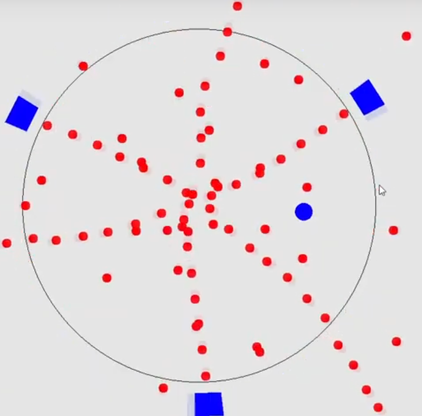
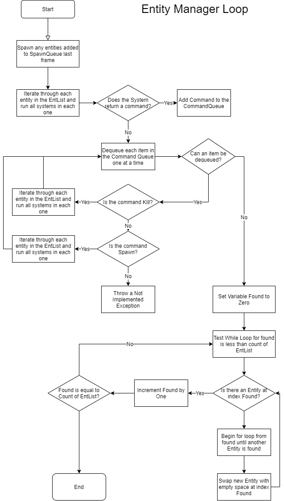
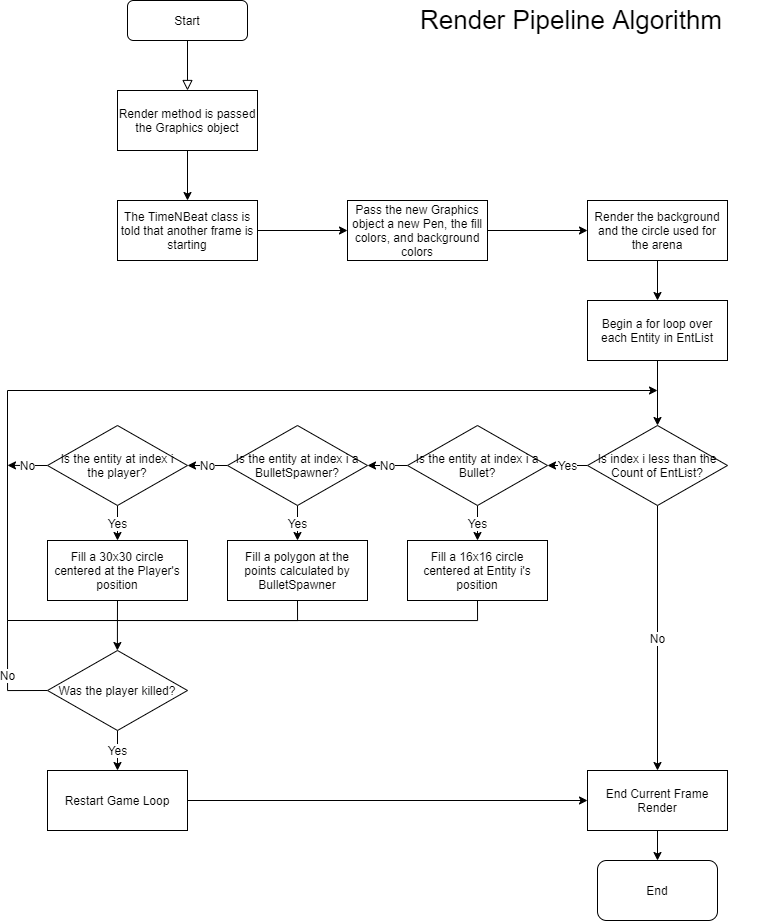

# CPSC39_BHGameProject
This is a short bullet hell / rhythm game I made for my final project in CPSC 39 at Merced College. The project was written in C# using Windows Forms for rendering, because I was a clown who hadn't learned how to use OpenGL yet.

Original Project Report:

&nbsp;&nbsp;&nbsp;&nbsp;&nbsp;&nbsp;This program is a short rhythm game made using a very simple and incredibly janky “game engine” that I cobbled together in the past three days. Everything in this project had to be narrowed in scope because of how ambitious my project proposal was, but it all works. The game is a bullet hell where the player is a blue circle dodging red circles shot at them from turrets rotating around an even larger circle, and lasts about 40 seconds before the hardcoded turret spawns run out and all you’re left with is the music. The player can move with the W, A, S, and D keys. 
&nbsp;&nbsp;&nbsp;&nbsp;&nbsp;&nbsp;The Entity Manager class is effectively the “game engine,” but I don’t want to call it that because of how little there is to it. Every object in the game inherits from the same abstract, and everything that inherits from Entity is able to hold a list of Systems specific to its own entity type. This is so small that I really shouldn’t be caring about memory, but having every game object that would behave the same use the same instance of an object for its logic saves a fair bit of memory. This approach resulted from me having to totally scrap my initial Entity-Component-System design after I realized I had completely messed it up and didn’t have time to fix it. 
&nbsp;&nbsp;&nbsp;&nbsp;&nbsp;&nbsp;The three main entities are bullets, bullet spawners, and the player, bullets and the player inheriting from the KinematicBody class. The systems, such as player movement, bullet movement, spawner rotation, collision detection, and several others, are run every game tick. I also ended up implementing a terrible version of the command pattern by having systems add commands, the only two of which I finished being Spawn and Kill, to the queue of commands in the EntityManager class. 
&nbsp;&nbsp;&nbsp;&nbsp;&nbsp;&nbsp;I also wrote a TimeNBeat class, which is a static class that is only updated by the Canvas, and can be accessed by systems to keep track of time and the current “beat” that the song is at. There is also a KeyHandler static class that is accessed by the player and updated when KeyDown and KeyUp events for W, A, S, and D are reported by Windows Forms. The programming for the actual “game” is all in the Canvas class for the Windows Form, and is very simple. After the timer, brushes, pen, SoundPlayer, GameTiming class, and EntityManager are instantiated, the Canvas_Paint loop calls for the entity manager to update, and renders to the canvas every 7 milliseconds (or however long it takes for the render and next update to finish). Rendering is simply iterating through the list of entities and using an if-else tree with pattern matching to identify and draw each respective entity on the screen. 
&nbsp;&nbsp;&nbsp;&nbsp;&nbsp;&nbsp;All the visuals were rendered on screen using Windows Forms and .NET’s System.Drawing for C#, and all of the written code in the solution (except for the auto generated methods from Windows Forms) was written by me. I chose C# because I believed pattern matching would make what I was trying to do a lot easier (but it turned out that the version I used doesn’t allow pattern matching in switch statements, so that was a flop), and because it’s the language I have the most experience in, am most comfortable using, and want to gain experience with the most. .NET also has a very efficient System.Drawing class for what it is, so I believed that would be useful as well.

Entity Manager Loop Algorithm:
    This algorithm, being the heart of the entire project, is in charge of updating and maintaining the list of entities. Its update method is called every frame, and runs all the core functions of the game. First, it will test if any entities have sent a command to spawn a bullet, and send those to the spawn command before anything else is done. It will then run the array of systems held by each Entity in the list, passing the Command queue to each system so that it can add a command if a specific event occurred. After this, all commands in the command queue are dequeued and processed, the only two working commands being kill, which removes an entity from the entList, and spawn, which adds an entity to the SpawnQueue. Finally, the sort function, which is incredibly simple because order doesn’t matter in the entList. There is only one pointer, the found variable, and it is incremented by one each time it finds an entity, and continues to do so until it has found every entity in the list. If there is a gap, it will search ahead in the list for the next entity and swap that with the empty space at the found pointer.
    
    
Render Pipeline Algorithm:
    It would be a bit of a stretch to call it a “render pipeline,” but I can’t think of anything better. This algorithm creates a new pen, new colors, and new fill brushes from the Graphics object for the next frame, then fills in the background and draws the arena. A for loop then iterates through the entity list in the current Entity Manager and matches the pattern of each entity to either a bullet, bullet spawner, or the player. For bullets, a 16x16 circle is filled at the bullets position. For bullet spawners, an isosceles trapezoid is filled as a polygon by “casting a ray” out from the center of the circle toward points four degrees clockwise and counterclockwise from the center of the trapezoid, and then multiplying the unit vectors by the distance to the close face of the trapezoid for the two closer points, and multiplying by the distance to the far face for the further points. For the player, a 30x30 pixel circle is filled at the player’s position. Lastly, the algorithm checks if the player was killed, and restarts the entire game if they were (but this feature is broken and after spending a couple hours trying to fix it I just gave up).
